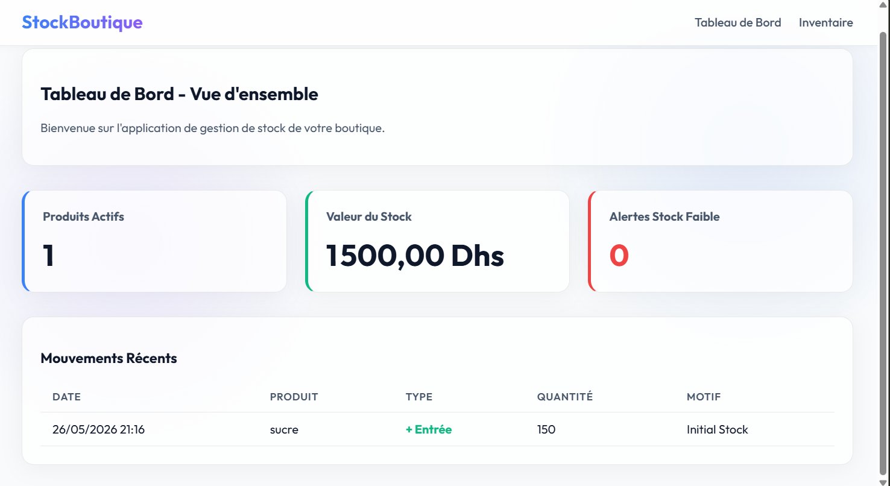
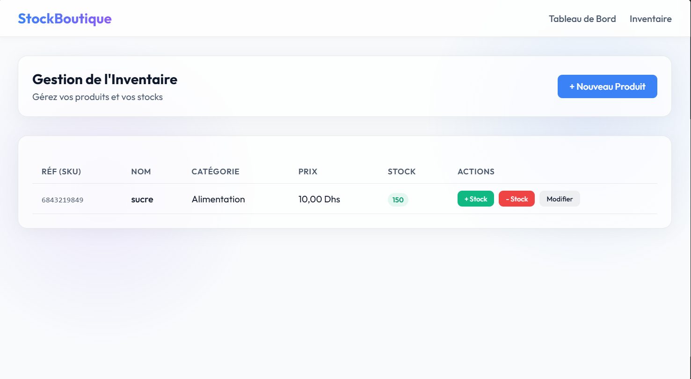
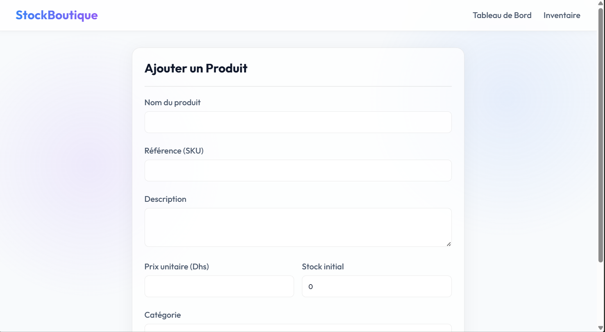

# StockBoutique - Application de Gestion de Stock

**StockBoutique** est une application web moderne développée en **ASP.NET Core MVC** permettant la gestion complète de l'inventaire d'une boutique. Elle offre un suivi en temps réel des produits, des catégories et des mouvements de stock (entrées/sorties).

## 👨‍💻 Auteurs
Ce projet a été conçu et développé par :
- **Mataich Walid**
- **Khalloufi Mehdi**

## ✨ Fonctionnalités Principales
- **Tableau de Bord Interactif :** Vue d'ensemble de l'inventaire, avec le nombre total de produits, la valorisation globale du stock en Dhs, et des alertes automatiques pour les stocks faibles.
- **Gestion des Produits :** Création, modification et suivi des produits avec leur référence (SKU) et leur catégorie.
- **Gestion des Mouvements de Stock :** Ajout et retrait rapide de quantités de stock, avec historisation des motifs (ex: réassort, vente, perte).
- **Interface Premium (Light Mode) :** Design moderne et épuré avec des effets de transparence ("Glassmorphism"), optimisé pour une lecture facile et une navigation fluide.
- **Base de Données PostgreSQL :** Persistance des données fiable grâce à Entity Framework Core et PostgreSQL.

## 🛠 Prérequis
Avant de lancer le projet, assurez-vous d'avoir installé les outils suivants sur votre machine :
1. [.NET 8.0 SDK](https://dotnet.microsoft.com/download)
2. [PostgreSQL](https://www.postgresql.org/download/) (en cours d'exécution sur le port local `5499` par défaut, ou à modifier dans les paramètres)
3. L'outil CLI Entity Framework Core (`dotnet tool install --global dotnet-ef`)

## 🚀 Installation & Configuration

### 1. Configuration de la base de données
Ouvrez le fichier `appsettings.json` situé à la racine du projet et vérifiez/adaptez la chaîne de connexion selon votre configuration PostgreSQL (Port, Username, Password) :
```json
"ConnectionStrings": {
  "DefaultConnection": "Host=localhost;Port=5499;Database=stockboutiquedb;Username=postgres;Password=votre_mot_de_passe"
}
```

### 2. Application des Migrations
Ouvrez votre terminal dans le dossier du projet (`StockBoutique`) et exécutez la commande suivante pour créer la base de données et les tables :
```bash
dotnet ef database update
```
*(Cette commande va créer la base de données `stockboutiquedb` et insérer les données initiales par défaut).*

### 3. Lancement de l'Application
Toujours depuis le terminal dans le dossier du projet, lancez le serveur avec :
```bash
dotnet run
```
Une fois l'application démarrée, le terminal affichera l'URL locale (par exemple `http://localhost:5000` ou `https://localhost:5001`). Ouvrez cette URL dans votre navigateur web pour accéder à StockBoutique !

## 📂 Architecture du Projet (MVC)
L'application repose sur le design pattern **MVC (Modèle-Vue-Contrôleur)** monolithique :
- **Models/ :** Contient la définition de la structure des données (Produits, Catégories, Transactions).
- **Controllers/ :** Contient la logique métier et fait le lien entre la base de données (AppDbContext) et les Vues.
- **Views/ :** Contient l'interface utilisateur en HTML, CSS (Vanilla) et Javascript, générée via Razor (`.cshtml`).

## 📸 Captures d'écran

Voici quelques aperçus de l'application :

### Tableau de Bord


### Inventaire


### Formulaire Produit

